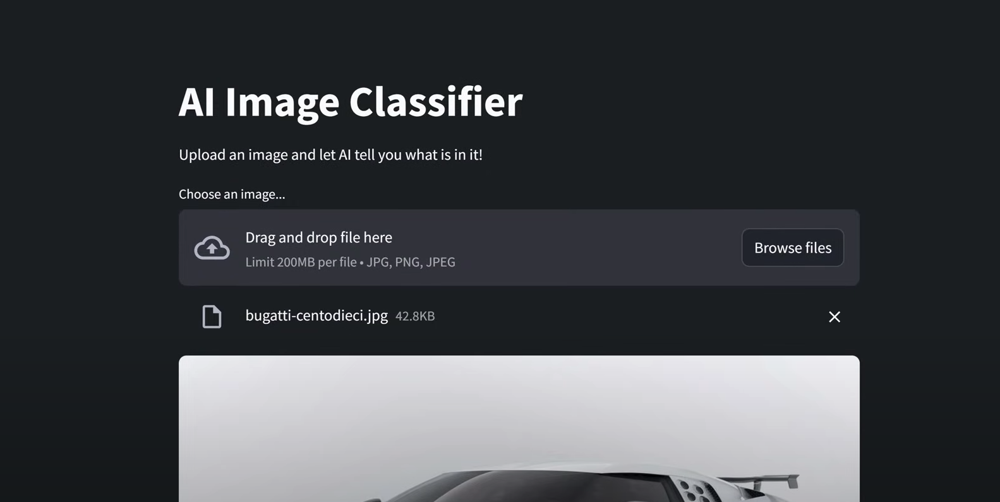

# 🧠 Streamlit + OpenCV + ML App


<div align="center">

🔍 **Real-Time Image Classification with Streamlit + OpenCV**  
💡 Powered by TensorFlow or PyTorch (MobileNetV2)  
⚙️ Fully runs in a local virtual environment using [`uv`](https://github.com/astral-sh/uv)

</div>

---

## 📦 Tech Stack


---

## ⚙️ Features

- 📸 Image Upload and Webcam Capture (OpenCV)
- 🧠 Image Classification using **MobileNetV2**
- 🖼️ Real-Time Prediction Display
- 💻 Modern UI using **Streamlit**
- ✅ Runs in isolated `.venv` via `uv`

---

<details>
<summary>📁 Project Structure (click to expand)</summary>

```bash
Python_Project_2/
│
├── .venv/                   # Virtual environment (managed by uv)
├── main.py                  # Streamlit application script
├── 2.png                    # Screenshot used in README
├── requirements.txt         # Package list (optional)
└── README.md                # This file
````

</details>

---

## 🚀 Getting Started

### ✅ Step 1: Clone or download the project

```bash
git clone https://github.com/yourusername/Python_Project_2.git
cd Python_Project_2
```

Or download as a ZIP and extract.

---

### ✅ Step 2: Initialize virtual environment

```bash
uv init .
```

---

### ✅ Step 3: Install dependencies (choose one)

#### 🔹 Option A — PyTorch (✅ works with Python 3.13)

```bash
uv add streamlit opencv-python torch torchvision --link-mode=copy --no-cache
```

#### 🔸 Option B — TensorFlow (⚠️ requires Python ≤ 3.12)

```bash
uv add streamlit opencv-python tensorflow --link-mode=copy --no-cache
```

---

### ✅ Step 4: Run the app

```bash
.venv\Scripts\activate
streamlit run main.py
```

Your browser will open at `http://localhost:8501`

---

## 🧠 How It Works

1. **Streamlit UI** handles file uploads and user interaction.
2. **OpenCV** processes the image/webcam frame.
3. **MobileNetV2**, loaded via PyTorch or TensorFlow, performs real-time prediction.
4. Results are displayed in an interactive interface.

---

## 🧪 Example Use Cases

| Use Case               | Description                           |
| ---------------------- | ------------------------------------- |
| 🧍‍♂️ Object Detection | Classify objects in uploaded photos   |
| 🎥 Webcam Vision       | Capture and classify frames live      |
| 🎨 OpenCV Filters      | Apply real-time image transformations |
| 📱 Model Prototyping   | Deploy light ML models quickly        |

---

## 📸 App Preview



---

## ❓ Troubleshooting

| Problem                         | Solution                                                               |
| ------------------------------- | ---------------------------------------------------------------------- |
| `ModuleNotFoundError`           | Run `uv add <package>` inside `.venv`                                  |
| `.DS_Store: os error 32`        | Add `--link-mode=copy --no-cache` to the `uv add` command              |
| TensorFlow fails on Python 3.13 | Use PyTorch or install Python 3.12                                     |
| OneDrive file lock errors       | Move project to a non-OneDrive folder like `C:\PythonProjects\YourApp` |

---

## 🧾 License

This project is licensed under the MIT License.
Feel free to use, modify, and distribute it as needed.

---

## 🙏 Acknowledgements

* [Streamlit](https://streamlit.io/)
* [OpenCV](https://opencv.org/)
* [PyTorch](https://pytorch.org/)
* [TensorFlow](https://tensorflow.org/)
* [UV Package Manager](https://github.com/astral-sh/uv)

---

> *Developed with 💻 by **Ali Waseem***

